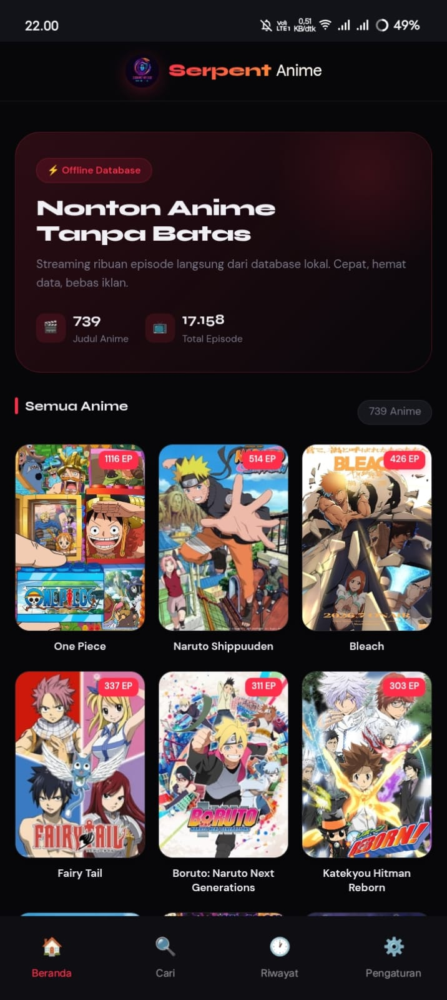
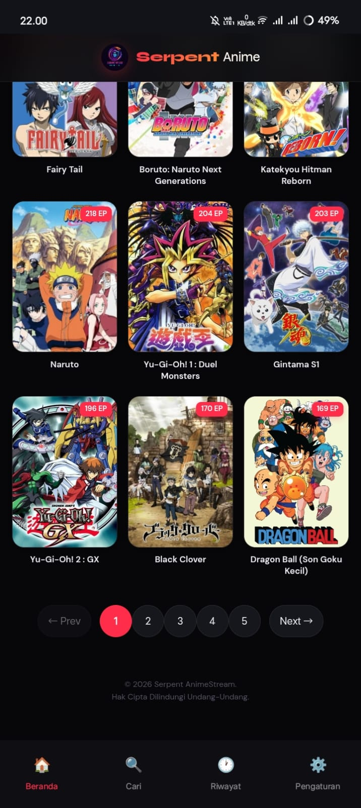
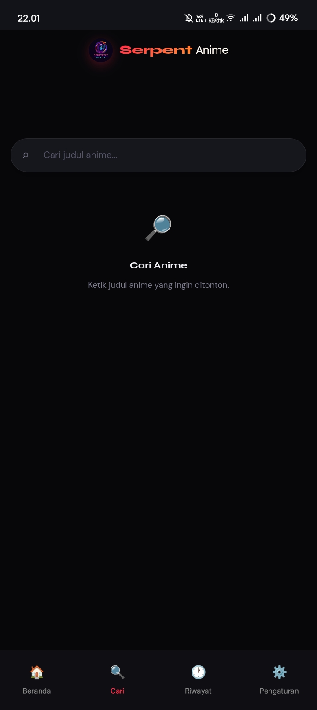
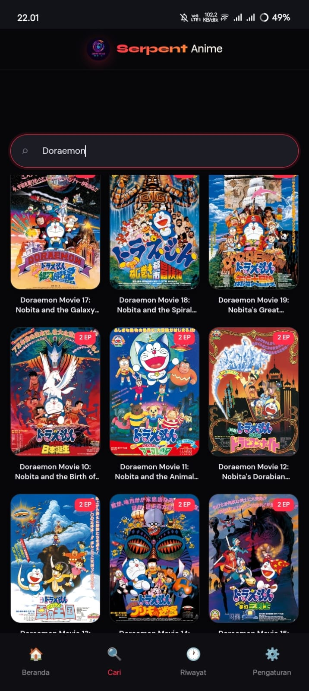
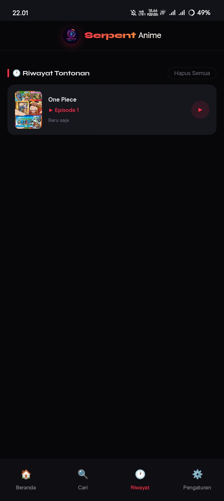

<div align="center">
  
  
  # Serpent AnimeStream

  **AnimeStreamOfflineAPK** — Aplikasi Streaming Anime modern berbasis Android WebView yang dirancang khusus untuk kecepatan, keindahan UI, dan kenyamanan tanpa gangguan iklan judi/pop-up.

  [](#)
  [](#)
  [](#)
  
</div>

---

## 🌟 Fitur Utama

- **Antarmuka Modern (UI/UX Premium)**: Desain *dark mode* elegan dengan efek *glassmorphism*, *shadow glow*, dan animasi mikro yang halus (ditulis dalam HTML/CSS murni).
- **Ad-Blocker Bawaan Terkuat**: Menangkal skrip pop-up, iklan judi, popunder, dan overlay slot machine langsung dari dalam WebView menggunakan DNS sinkhole *custom*. Nonton anime bebas gangguan!
- **Sistem Enkripsi Data**: Menggunakan data episode lokal yang dienkripsi secara aman (`episodes.enc`), memastikan keamanan data dan kemudahan pembacaan (Offline/Lokal).
- **Sistem Paginasi Interaktif**: Navigasi halaman anime yang mudah (`← Prev | 1 | 2 | 3 | Next →`) dengan penanda visual pintar untuk halaman aktif.
- **Pencarian Real-Time**: Fitur pencarian *sticky bar* yang cepat tanpa membuat halaman harus me-refresh/kehilangan fokus.
- **Riwayat Tontonan Pintar**: Aplikasi secara otomatis menyimpan posisi episode terakhir yang Anda tonton, sehingga Anda bisa melanjutkannya kapan saja.
- **Multi-Server Streaming**: Mendukung pemutaran dari berbagai *server embed* dengan opsi mengganti kualitas (1080p, 720p) dan tombol buka eksternal.

## 📸 Tangkapan Layar (Screenshots)

| Beranda | Pencarian | Hasil Cari | Riwayat | Pengaturan |
| :---: | :---: | :---: | :---: | :---: |
|  |  |  |  |  |

## 🛠️ Teknologi yang Digunakan

- **Android Native (Kotlin)**: Sebagai tulang punggung (*wrapper*) aplikasi, menyediakan jembatan komunikasi (*AndroidBridge*) antara sistem Android dan UI.
- **Android WebView Client**: Mencegat *request* HTTP untuk memblokir iklan jahat (*shouldInterceptRequest*).
- **Vanilla HTML/CSS/JavaScript**: Seluruh antarmuka aplikasi dibangun murni menggunakan teknologi web modern untuk fleksibilitas maksimal, tanpa terbebani *framework* berat.

## 🚀 Cara Instalasi & Kompilasi

1. **Clone repositori ini:**
   ```bash
   git clone https://github.com/SerpentSecHunter2006/AnimeStreamOfflineAPK.git
   ```
2. **Buka di Android Studio:**
   Buka folder proyek yang baru saja Anda unduh.
3. **Sinkronisasi Gradle:**
   Tunggu hingga Android Studio menyelesaikan sinkronisasi Gradle (biasanya otomatis).
4. **Jalankan Aplikasi:**
   Hubungkan *smartphone* Android Anda atau gunakan Emulator, lalu klik tombol **Run** (Ikon Play Hijau).

## 🛡️ Sistem Pemblokir Iklan (Ad-Blocker)

Aplikasi ini dilengkapi penyaring otomatis pada `MainActivity.kt` yang secara proaktif akan memblokir *request* dari penyedia iklan agresif yang sering menempel pada *iframe* penyedia video (seperti popads, onclickads, bet365, dll).

## 📝 Lisensi

Proyek ini didistribusikan di bawah Lisensi MIT. Lihat file `LICENSE` untuk informasi lebih lanjut.

---

<div align="center">
Dibuat dengan ❤️ oleh <b>SerpentSecHunter2006</b>
</div>